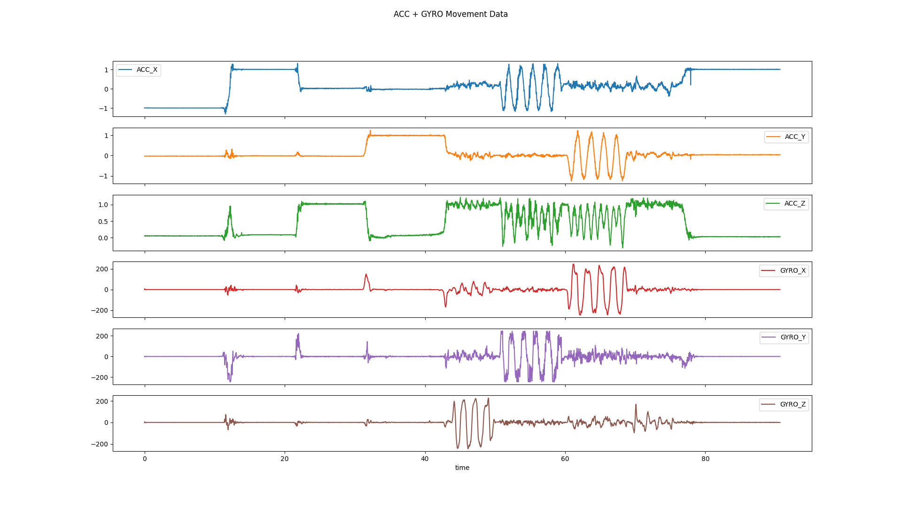

# OpenMuse

*The Open Python Muse S Athena EEG Decoder*

[](https://github.com/DominiqueMakowski/OpenMuse/actions/workflows/ci.yml)
[](https://eu.choosemuse.com/products/muse-s-athena)


This software allows recording, streaming via LSL and visualizing signals from the **Muse S Athena** headband.

> [!WARNING]  
> OpenMuse is NOT an official product of InteraXon Inc and is not affiliated with or endorsed by the company. It does not come with any warranty and should be considered an experimental software developed for research purposes only.

## Roadmap

- [x] Record raw data to a file
- [x] Decode raw data into a pandas DataFrame
- [x] Stream data over LSL
- [x] Visualise live LSL streams
- [x] Stream in battery signal and display battery level in visualizer
- [ ] Consider adding a visualization of the PSD of each signal
- [ ] Validate timestamping accuracy experimentally: confirm we get time-locked ERPs
- [ ] Validate the best PPG signal extraction method
- [ ] Validate fNIRS signal extraction method

## Installation

Install from GitHub by opening a terminal and running:

```powershell
pip install https://github.com/DominiqueMakowski/OpenMuse/zipball/main
```

## Usage

After installing the package, open a terminal and use the following commands:

### Find Muse devices

Power up the Muse S Athena headband (a blue light should appear on the front) and run:

```powershell
OpenMuse find
```

This will print the MAC addresses of nearby Muse devices. Note the address of your device for the next steps.


### Record data to a file

```powershell
OpenMuse record --address <your-muse-address> --duration 60 --outfile data.txt
```

> [!TIP]
> By default, recording and streaming use the `--preset p1041`, which enables all channels. You can change the preset using the `--preset` argument (see below for the list of documented presets).

#### Loading Recorded Data

Once your file is recorded, you can load it in Python using:

```python
import pandas as pd
import OpenMuse 

with open("data.txt", "r", encoding="utf-8") as f:
    messages = f.readlines()
data = OpenMuse.decode_rawdata(messages)

# Plot Movement Data
data["ACCGYRO"].plot(
    x="time",
    y=["ACC_X", "ACC_Y", "ACC_Z", "GYRO_X", "GYRO_Y", "GYRO_Z"],
    subplots=True
)
```



### Lab Streaming Layer (LSL)

> [!NOTE]  
> OpenMuse uses [MNE-LSL](https://mne.tools/mne-lsl/), an improved python-binding for the Lab Streaming Layer C++ library, `mne_lsl.lsl`, replacing `pylsl`.

To stream data over LSL, use:

```powershell
OpenMuse stream --address <your-muse-address>
```

This creates **separate LSL streams** for groups of channels (`Muse_EEG`,  `Muse_ACCGYRO`, etc.).

The following options are available:
- `--address`: The MAC address of your Muse device (required)
- `--duration`: Duration of the recording in seconds (if not specified, streaming will continue until you press Ctrl+C in the terminal)
- `--preset`: Preset configuration (default: `p1041` for all channels)
- `--record`: Record raw BLE packets to a file (optional)

### Visualize Live Streams

To visualize live LSL streams, open a new terminal (while the streaming is running) and run:

```powershell
OpenMuse view
```

### Hyperscanning (Multiple Devices Streaming)

To record from multiple Muse devices simultaneously (e.g., for hyperscanning studies):

1. **Discover devices**: Power on all Muse headbands and run `OpenMuse find` to note down each device's MAC address.

2. **Start streaming**: You can stream from multiple devices simultaneously by passing multiple MAC addresses:

```powershell
OpenMuse stream --address 00:55:DA:B9:FA:20 00:55:DA:BB:CD:CD
```

This will manage all connections in parallel within a single process. LSL streams will be named with their respective device IDs (e.g., `Muse-EEG (MAC1)`), allowing you to distinguish them on the receiving end.

3. **Visualize (optional)**: When multiple devices are streaming, the viewer will automatically detect and display streams from only the first device by default to avoid confusion. To view a specific device, use the `--address` filter:

```powershell
# View first device
OpenMuse view --address 00:55:DA:B9:FA:20

# View second device (open in a separate terminal)
OpenMuse view --address 00:55:DA:BB:CD:CD
```

> [!NOTE]
> If you run `OpenMuse view` without the `--address` argument when multiple devices are streaming, it will automatically select the first detected device and display a warning message listing all available devices.

4. **Record with LabRecorder**: Use [LabRecorder](https://github.com/labstreaminglayer/App-LabRecorder) to record all streams to an XDF file. Select all the streams from your devices (e.g., `Muse-EEG (00:55:DA:B9:FA:20)`, `Muse-EEG (00:55:DA:BB:CD:CD)`, etc.).

#### Multi-Device Raw Recording (Alternative to LSL)

You can also do raw BLE packet recordings from multiple Muse devices simultaneously by passing multiple MAC addresses:

```powershell
OpenMuse record --address 00:55:DA:B9:FA:20 00:55:DA:BB:CD:CD --duration 60 --outfile data.txt
```

When recording from multiple devices, the device address will be automatically appended to the filename to avoid collisions (e.g., `data_0055DAB9FA20.txt`, `data_0055DABBCDCD.txt`).

## Technical Details

### Specs

Muse S Athena specs (From the [Muse website](https://eu.choosemuse.com/products/muse-s-athena)):
- Wireless Connection: BLE 5.3, 2.4 GHz
- EEG Channels: 4 EEG channels (TP9, AF7, AF8, TP10) + 4 amplified Aux channels
  - Sample Rate: 256 Hz
  - Sample Resolution: 14 bits / sample
- Accelerometer: Three-axis at 52Hz, 16-bit resolution, range +/- 2G
- Gyroscope: Three-axis at 52Hz, 16-bit resolution, range +/- 250dps
- PPG Sensor: Triple wavelength: IR (850nm), Near-IR (730nm), Red (660nm), 64 Hz sample rate, 20-bit resolution
- fNIRS Sensor: 5-optode bilateral frontal cortex hemodynamics, 64 Hz sample rate, 20-bit resolution

### Presets

| Presets                                 | EEG   | Optics   | ACC/GYRO | Battery | Red LED |
|-----------------------------------------|:-----:|:--------:|:--------:|:-------:|:--------|
| p20, p21, p50, p51, p60, p61            | EEG4  |   —      |    X     |    X    |   off   |
| p1034, p1043                            | EEG8  | Optics8  |    X     |    X    | bright  |
| p1044                                   | EEG8  | Optics8  |    X     |    X    |  dim    |
| p1035                                   | EEG4  | Optics4  |    X     |    X    |  dim    |
| p1041, p1042                            | EEG8  | Optics16 |    X     |    X    | bright  |
| p1045                                   | EEG8  | Optics4  |    X     |    X    |  dim    |
| p1046                                   | EEG8  | Optics4  |    X     |    X    |   —     |
| p4129                                   | EEG8  | Optics4  |    X     |    X    |  dim    |

*Table derived from the signature of the data packets present in the data. More presets could exist.*

### Acknowledgements

This project would not have been possible without the breakthroughs of [amused-Py](https://github.com/Amused-EEG/amused-py) that identified the communication protocol and [AbosaSzakal's parser](https://github.com/AbosaSzakal/MuseAthenaDataformatParser) who documented the data structure.
